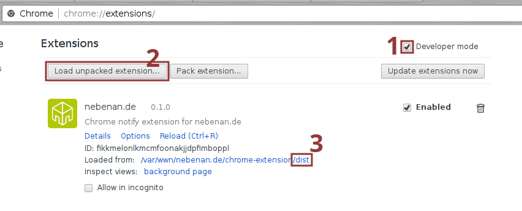
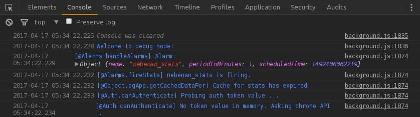

# [Nebenan.de](https://nebenan.de) Chrome Extension

## Quick Start

1. To build the extension from its sources, you will need [gulp](http://gulpjs.com/), as well as [lodash-cli](https://www.npmjs.com/package/lodash-cli).
  
```bash
npm i -g gulp lodash-cli
```

2. Clone repo, install dependencies, build

```bash
git clone https://github.com/rbeer/nebenan-extension.git
npm i
gulp
```

3. Install



## Gulp

### Main Tasks
This is a list of the main tasks, only.
There are plenty of auxiliary tasks, such as `clean`, `watch`, `requirejs`, ...

|     Task      | depends      | implied flags | does |
|---------------|--------------|---------------|------|
| **build**/default | clean        | --with-lodash | Main build chain; *production* |
| **dev**           | clean, watch | --dev, --with-docs | Build in developement mode and watch /app/; development builds are suffixed by -dev, e.g. 0.2.0-dev |
| **docs**          |              | --with-docs | Generates jsdoc for current version in /docs/ |
| **package**       |              |               | Package/Zip /dist/; meant for publication in Chrome Webstore; this does **not** create a valid .crx! |

### Flags

#### --dev
Sets build into DEV mode
 - Enables console.debug messages

   
 - Includes and loads [module:bg/dev](https://rbeer.github.io/nebenan-extension/0.2.0/module-bg_dev.html)
   Exposing `window.bgApp`, `bgApp.dev`, ...
 - Watch out for the [preprocess](https://www.npmjs.com/package/preprocess) parts in
   script files!

```js
 // @if DEV=true
 // included in .rjs-dev
 require(['bg/dev'], (dev) => {
   bgApp.dev = dev;
   bgApp.dev.init(bgApp);
 });
 // @endif
```

   A search for `// @` over
   `/app/scripts.babel/` should reveal them all.

#### --with-docs
 - Includes (js)docs generation

#### --with-lodash
Generating the [custom lodash library](https://lodash.com/custom-builds) takes up to 5 seconds - waaaay too long
when `watch`ing (e.g. in `dev` task), so the current (lodash) build will be copied, by default.
- `--with-lodash` forces gulp to generate the library.
